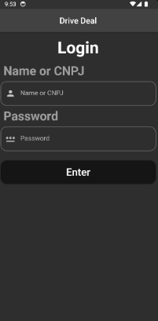

# drive_deal

Drive Deal, a mobile app designed for the management of a dealership network.

This application was made as an academic project during the Lince Tech Academy.

## Functionalities

- Login/register screen; user can login as either admin or partner
- Different app views depending on the type of user logged in (admin/partner)
- Register/edit forms, details screen
- Local database for persistent data storage (no backend server; local only)
- Theme/language options the user can choose from

## Screenshots

    

        <strong>Login page:</strong> 
        
    

    

        <strong>Partner store details:</strong> 
        
    

    

        <strong>Autonomy levels listing:</strong> 
        
    

    

        <strong>Partner's vehicle listing:</strong> 
        
    

    

        <strong>Vehicle info:</strong> 
        
    

